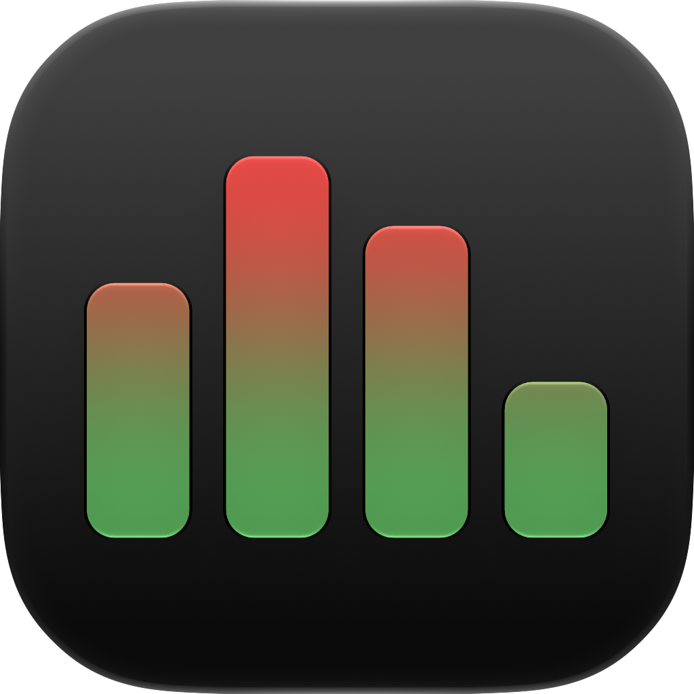
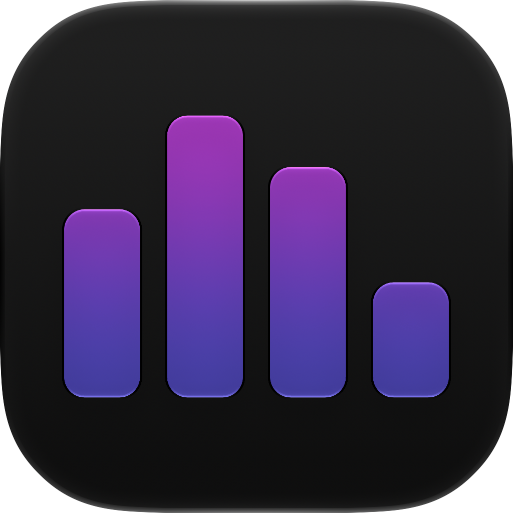
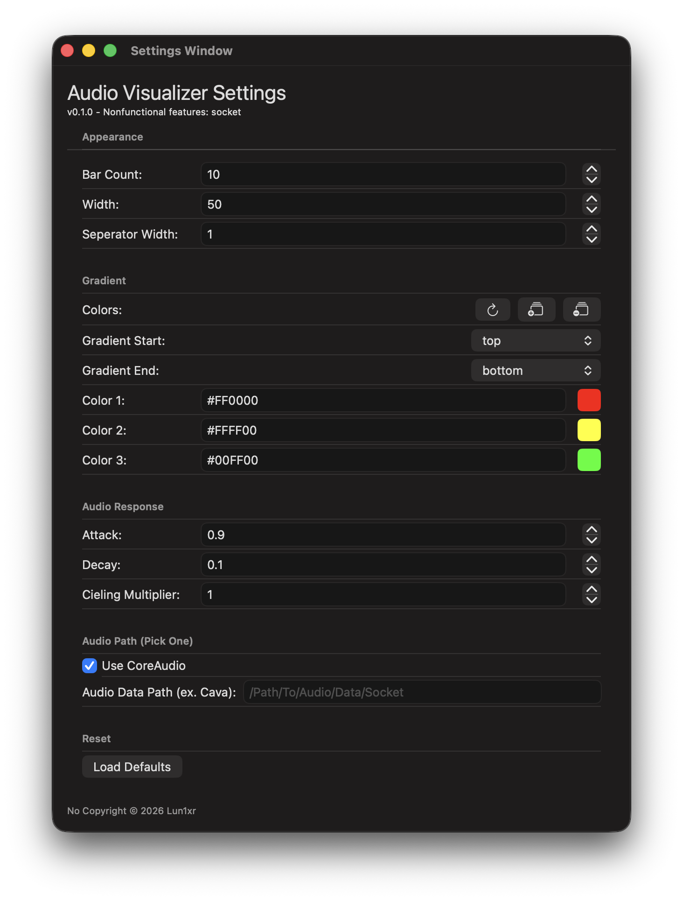
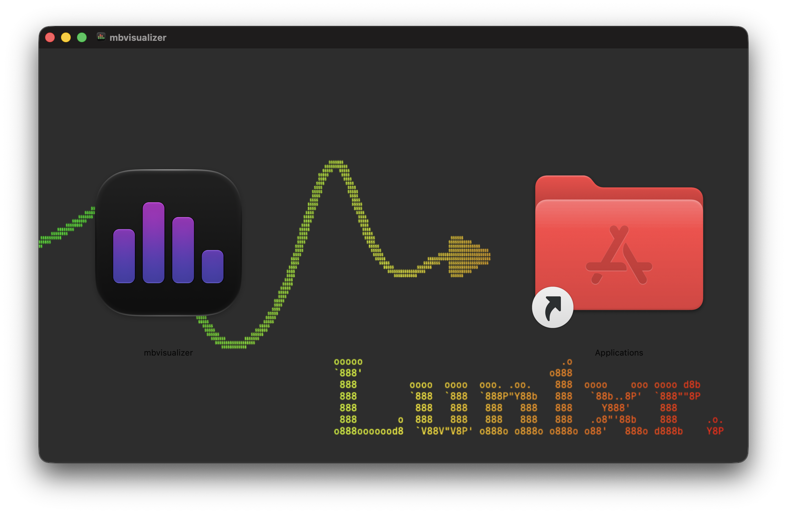

# mbvisualizer

This is a customizable audio visualizer (for the macOS menu bar) I made for fun and because I was bored. The audio response is optimized towards looking good, not accuracy. Uses CoreAudio for systemwide audio capture (I'm considering cava support) and the Accelerate framework to take advantage of native scalar functions for audio processing. I don't know/care if something like this already exists, this one's mine.

**Note: Single core CPU usage is around 10-15% for the signed release build (expect 2x for debug builds). Energy Impact still logs as "Low".**

 

## Settings

The settings are self explanatory for the most part. The defaults are my settings, which I've found to look ok. Try not to set anything to zero.

- **Gradient**: Supports 3 char (low precision RGB), 6 char (higher precision RGB), and 8 char (ARGB) hex

- **Attack & Decay**: Attack and Decay affect how the linear interpolation functions consider new data (higher numbers mean new data is weighted higher)

- **Audio Path**: Unchecking "Use CoreAudio" currently does nothing because I didn't implement the other option



## Use

The dmg and binary are signed and notarized, so regular install should work fine.



If it still gives you trouble go to Settings > Privacy & Security on first launch to manually allow the app to run. The system should prompt you to do this. I may upload to the App Store eventually.

## Build

To build/install from source with ```xcodebuild``` (I think):

```bash

git clone --depth 1 [https://github.com/lun1xr/mbvisualizer.git](https://github.com/lun1xr/mbvisualizer.git)

cd mbvisualizer

sudo xcodebuild -project "mbvisualizer.xcodeproj" install DSTROOT=/ INSTALL_PATH=/Applications

```

Or just open the project in Xcode and build it normally.
